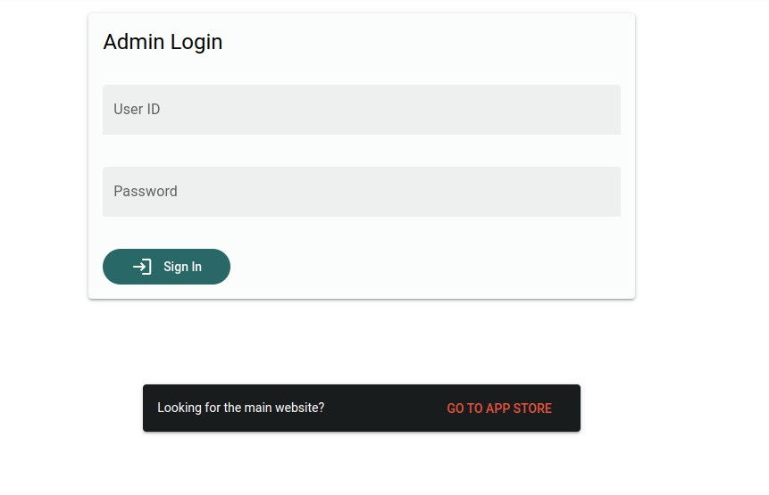

# Accessing the Admin Portal
To access the admin portal, you will need to head to the `/admin` endpoint. Type the URL as follows into your browser:
```
< insert ai appstore url>/admin
```

This will bring you to the admin login page, where you need to login with an account that has the administrator role.


Once logged in, you should be brought to the Admin Portal.
