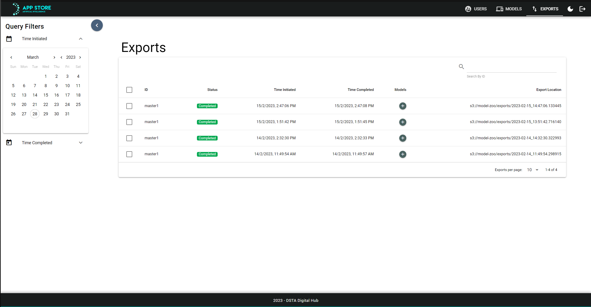
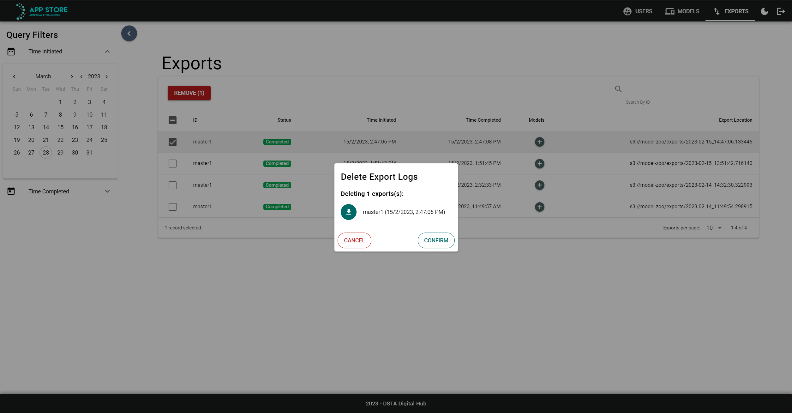

# Managing Exports

To manage/view exports, you need to be in the Admin dashboard, under the Exports tab. The screen should look something like this:

From this dashboard you will be able to view the progress and information of the exports of models performed by admins. Additionally, the exports can be removed as well.

## Removing Exports

To remove any number of exports, select the checkbox next to the exports you want to remove, and click on the "Remove" button.

You will then have a confirmation prompt to show you which exports will be removed. Clicking "Confirm" will remove these exports. This will remove the log of the export inside the database as well as the related export files stored in the S3 bucket.
