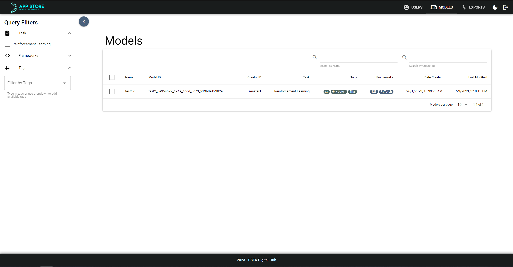
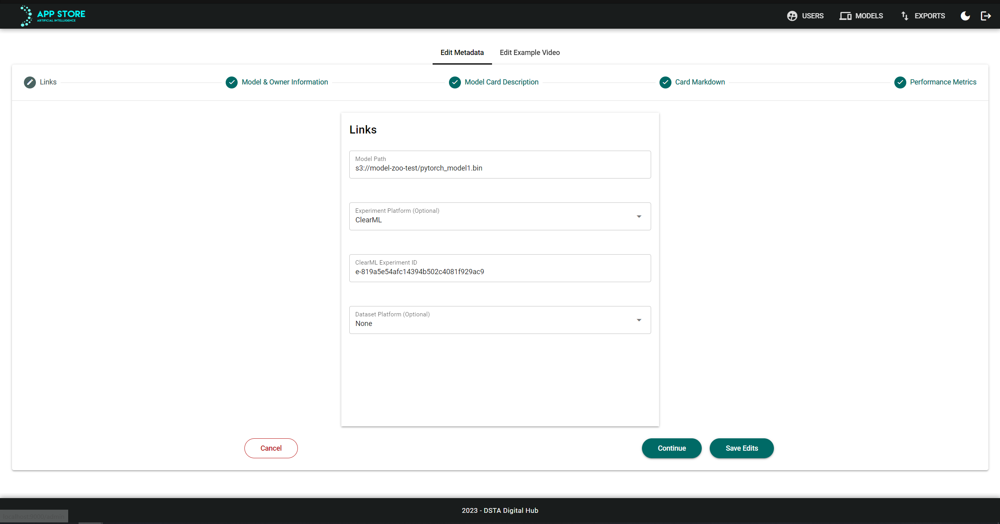
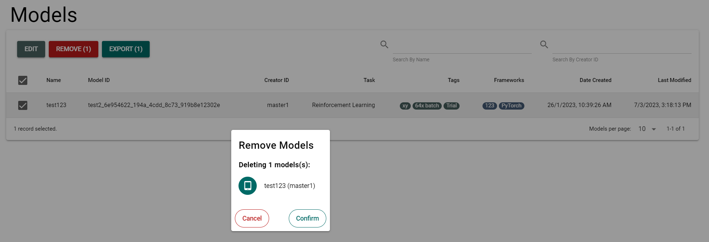
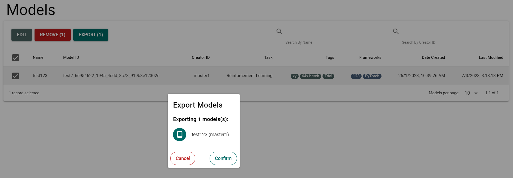

# Managing Models

To manage models, you need to be in the Admin dashboard, under the Models tab. The screen should look something like this:

From this dashboard you will be able to edit, remove and export models of your choosing.

## Editing Models

To edit a model, select the model using the checkbox and click the "Edit" button at the top of the table. You will then see a form that you can edit the current information of the model from and save your changes accordingly

## Removing Models

To remove any number of users, select the checkbox next to the models you want to remove, and click on the "Remove" button.

You will then have a confirmation prompt to show you which models will be removed. Clicking "Confirm" will remove these models.

## Exporting Models

To export any number of models, select the checkbox next to the models you want to remove, and click on the "Export" button.

You will then have a confirmation prompt to show you which models will be exported. Clicking "Confirm" will initiate the exporting of the models to be done in the background. The information related to the exports (e.g., status of export, models exported, export location, etc.) can be found on the export dashboard (See: [📦Exports Dashboard](./managing-exports.md)).

## Importing Models

### Work In Progress
