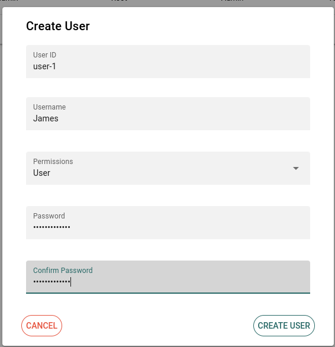

# Managing Users
To manage users, you need to be in the Admin dashboard, under the Users tab. The screen should look something like this:

## Creating a New User
To create a new user, click on the circular "+" button on the bottom right of the screen. 

This will open up a form for you to add in a new user, with the following fields to fill up

| Field | Description | Example | 
|----|----|----|
| User ID | The user ID is a unique identifier for a user, used for authentication | user-1 |
| Username | Can be the real name of the user, does not have to be unique | James |
| Permissions | Permission level of account. Either "User" or "Admin" | User |
| Password | Password used for authentication. Must be at least 8 characters long, with 1 uppercase character, 1 lowercase character, 1 number and 1 special character | Ex@mplePassw0rd1234! | 

## Editing a User
By clicking on the checkbox next to a single user and clicking on the "Edit" button on the top of the table, you can edit the following details of a user:
- Name 
- Permission Level
- Password (Change password)

### Editing Multiple Users
By using the checkbox to select multiple users, you can edit multiple users at the same time. This allows you to set the permission level of multiple users.

## Removing a User
To remove any number of users, select the checkbox next to the users you want to remove, and click on the "Remove" button.

You will then have a confirmation prompt to show you which users will be removed. Clicking "Confirm" will remove these users.

