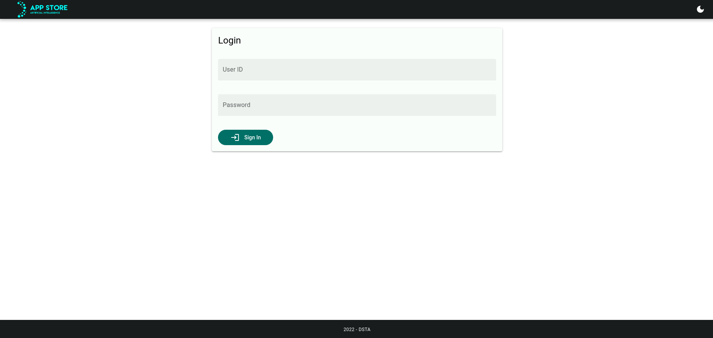

# User Authentication

## Registering an Account

To get an account on the AI App Store, you will need to get a system administrator to create an account for you through the Admin Dashboard on the AI App Store.

## Logging In

Assuming that your account has been created, head to the AI App Store site, where you should be redirected to the login page. To log in, simply type in your User ID and Password.

Upon a successful login, you should be re-directed to the dashboard.
