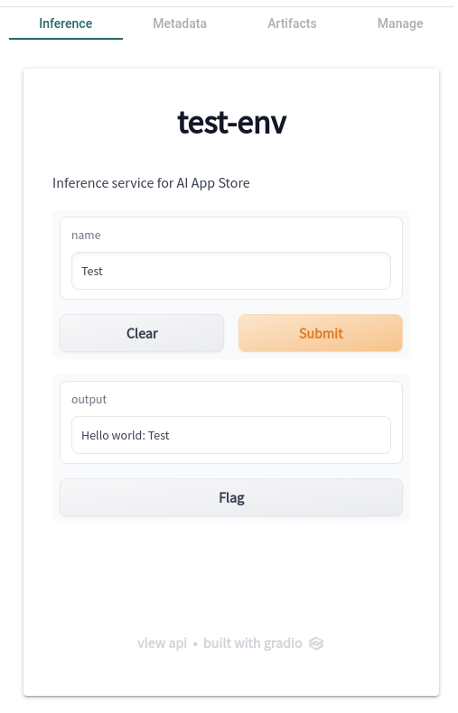
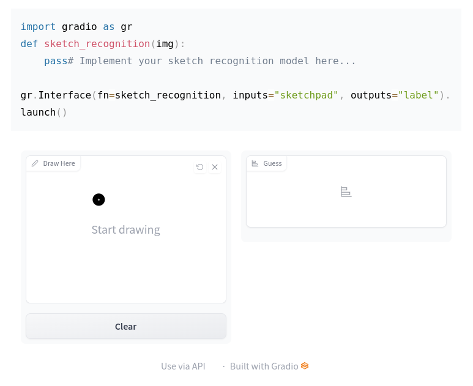

# What is an Inference Service?
To enable users of the App Store to try out your model, we'll need your help to supply a front-end user interface for your model. This is done by creating an Inference Service. An Inference Service is a web application that allows users to interact with your model. The Inference Service is built using [Gradio](https://gradio.app/), a Python library that allows you to build interactive web applications for your models.

Whenever you view a model card, you will see a tab called "Inference". This tab will contain the front-end user interface for your model.

## What is Gradio?
Gradio is a Python library that allows you to build interactive web applications for your models. It is a great way to share your machine learning model, API, or data science workflow with others. Gradio allows you to build demos and share them, all in Python.

## How does it work?

For a deeper overview of how to create an Inference Service, check out the [Building Inference Services](building-inference-services.md) guide. 

The following is a high-level overview of the steps you need to take to create an Inference Service.

1. You create a Python script for a Gradio application. This script will contain the code needed to infer on your model. (e.g Set up Gradio to use Triton Client to send requests to your model hosted on Triton Inference Server)
2. You containerize your application using Docker. This will allow us to deploy your application on our infrastructure.
3. You load the container image to our registry. This will allow us to deploy your application on our infrastructure.
4. You submit your application to the App Store. This will allow users to try out your model. When users load your model card, we will automatically serve the front-end user interface for your model.
