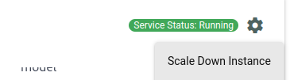
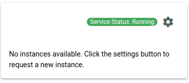
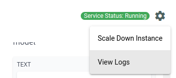
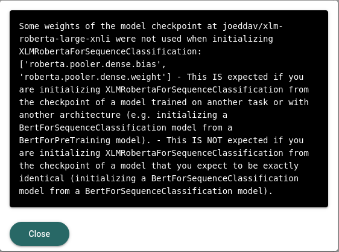

# Managing Inference Services

## Scaling Instances
In the event that you want to manually bring down your service, you can go to the settings menu of the inference service frame (click on the cog icon), where you will see a "Scale Down Instance" button. 

Clicking on it will cause the service to go down, as we scale the number of instances to 0.

In the same vein, you can also restore the instance, by clicking on the "Request New Instance" button. Note that it may take a while for the instance to be available after clicking that button.

## Repairing a Service
In the event that a service is broken somehow (e.g the deployment was accidentally removed from the cluster), we offer a "Repair Service" button, which will attempt to restore a service. 

This button will appear in the application frame should the service status be unhealthy. 

## Viewing Logs
A model owner is able to view the application logs by clicking on the Settings button in the app frame (shown as a cog), and clicking the "View Logs" button, which will show a live feed of the application logs. 

