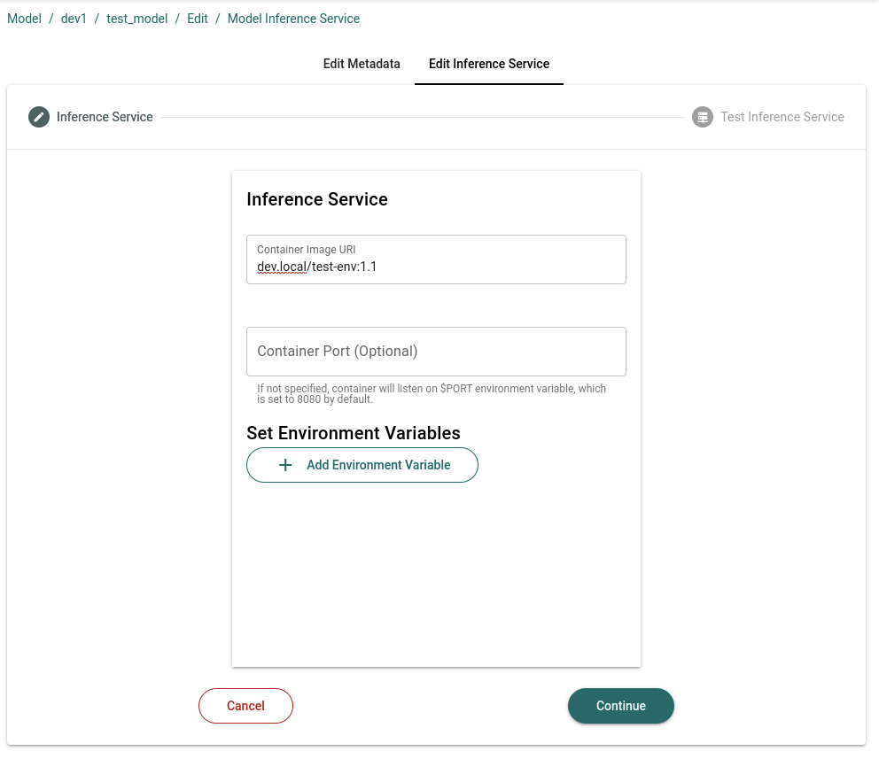

# Updating an Inference Service
In general, updating an Inference Service is a simple process. You will need to update the code for your Gradio application, rebuild the container image, tag it with a new version number, and then load the new image to our registry.

Then, you will need to do the following:
1. Go to your model card on the App Store, and click on the "Manage" tab.
2. Click on the "Edit Model Inference Service" button.
3. Enter the new image tag for your Inference Service.
4. Test your inference and submit.

