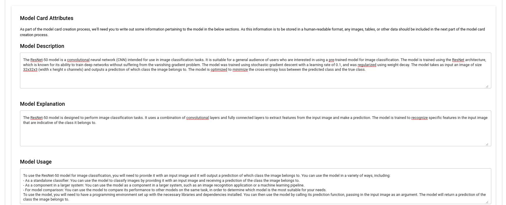
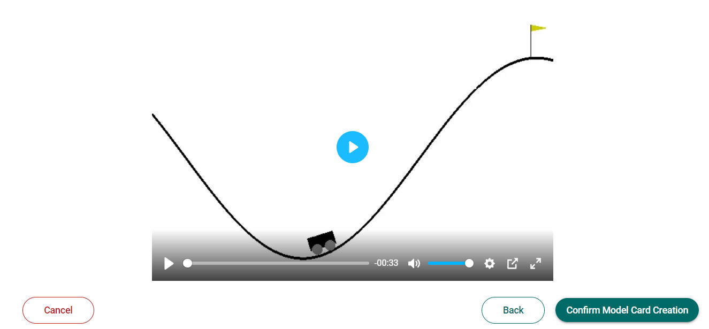

# Submitting Model Cards

To submit a model card, start by accessing the Create Model page. It can be accessed by either clicking on the "+ Create Model" button on the app side-bar, or by clicking on the floating action button on the dashboard.


Once you are in the create model form, follow the wizard to create your model card. As you complete each section of the form, click on the "Continue" button to move on to the next section. At any time, you can go back to a previous section to make any necessary changes.

## Submitting Metadata

### Links

In the first section, you can supply the Model Path, and provide any linked experiments. When an experiment ID is provided, we will attempt to retrieve information from the related experiment and use it to populate later fields of the model card.


> For more information on integration with experiment tracking platforms such as ClearML, check out [ClearML Integration](../integrations/clearml.md)

### Model & Owner Information

In the next section, supply more metadata on the model, such as the model name, task, subject tags and ownership.

Note the following:

- The subject tags and frameworks field allow for multiple inputs.
- The model owner and point of contact do not necessarily have to correspond to any User IDs within the AI App Store.
  

### Model Card Attributes

In the next section, fill up the fields with information relating to the model description, usage, and limitations of the model. Note that all values stored here are in plaintext (i.e. no images, tables etc) as they are intended to be usable for export into a table in human-readable format.



### Card Markdown

The next section contains an editor for writing markup which will be shown to users viewing the model card. By clicking on the "Populate Card Description" button, you can populate the editor with the information provided in the prior section.


Note that the editor supports the following features:

- Writing **Bold**, _Italic_, <ins>Underlined</ins>, ~~Strikethrough~~ text
- Headings (Up to 3 levels)
- Bullet lists
- Numbered lists
- Images
- Tables
- Plotly.js Graphs

### Performance Metrics

The next section allows you to write more regarding the performance of your models.

If you have linked an experiment (e.g ClearML experiment) to your model card, clicking on the "Retrieve plots from experiment" will attempt to obtain any plots that were logged as part of your experiment.

#### Using the Chart Editor

The chart editor helps you to create Plotly.js plots by supplying Plotly JS compatible JSON data. The core part of the editor is a JSON file editor, which enables you to edit the JSON data in three modes:

- Text: useful if you want to copy paste JSON
- Tree
- Table


A Plotly.js JSON object is a JavaScript object that contains the data and layout for a chart. It has the following structure:

```json
{
  "data": [
    {
      "type": "scatter",
      "x": [1, 2, 3],
      "y": [4, 5, 6]
    }
  ],
  "layout": {
    "title": "My Chart"
  }
}
```

The data field should contain an array of objects, each representing a trace (i.e. a series of data points) in the chart. The layout field should contain an object that defines the layout and appearance of the chart.

Each trace object should contain a type field that specifies the type of chart (e.g. "scatter", "bar", etc.), and a x and y field that contain the data for the trace. The layout object can contain a wide range of properties that control the appearance and behavior of the chart, such as the title, axis labels, and legend.

For a complete list of the properties that can be included in the data and layout objects, you can refer to the [Plotly.js documentation](https://plotly.com/javascript/basic-charts/).

## Submitting an Inference Service

Alongside your application, you will also need to submit an Inference Service image, which is a web application that exposes your model for test inferences. If you have not built one, please refer to [Building Inference Services](../inference-services/building-inference-services.md).

Assuming that your service has already been built and loaded into the cluster, you will need to provide the full image URI (including the registry). You may also provide additional settings such as specifiying the values of environment variables (allowing you to customize the behaviour of your application).

> For now, we'll require you to ensure your application app listens to port 8080.


When you click on "Submit Image", we will temporarily create a service to allow you to test your application.


Once you've tested out your inference service, submit your model card with the "Confirm Model Card Creation" button.

## Submitting an Example Video in place of Inference Service

In some cases, such as with Reinforcement Learning tasks, an Inference Service may not always work.

Hence, the option of submitting an example video is provided for such tasks and situations, allowing you to showcase the agent's/model's performance in the chosen environment.

> The video must be in some type of widely accepted video format (e.g., MP4, MOV, MKV) and must be under 10MB for it to be accepted by us


When you click on "Submit Video", we will temporarily display the submitted video in a media player for viewing to ensure that it's the video you want to submit to us.



# Conclusion

Congratulations, you have successfully submitted your model card! The final output should look something like this:

