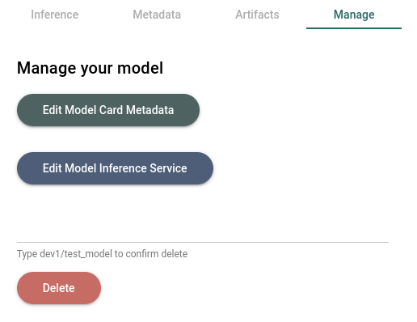
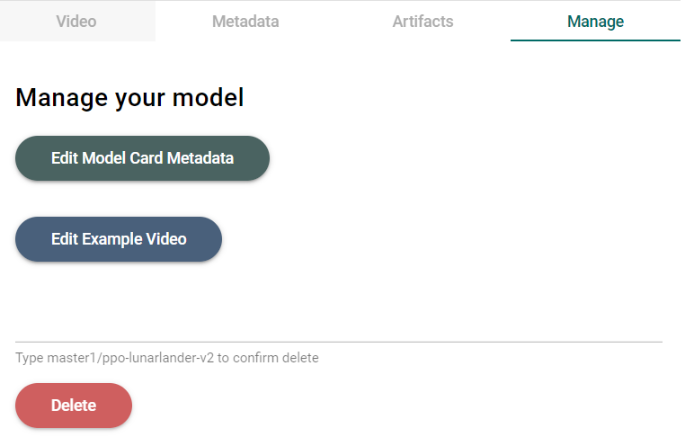

# Updating Model Cards
Over time, your model may change. This could be due to improvements in the model itself, or changes in the data used to train it. In this case, you may want to update the model card to reflect these changes. This guide will show you how to do this.

## Updating the model card
Start by navigating to the model card you want to update. Then, go to the "Manage" tab, where you will see three options:
- Edit Model Card Metadata
- Edit Model Inference Service/Edit Example Video
- Delete Model Card

Click on "Edit Model Card Metadata" to update the model card. You will see a form that looks like the model creation form. You can update any of the fields in this form. When you are done, click "Save Edits" to save your changes.
