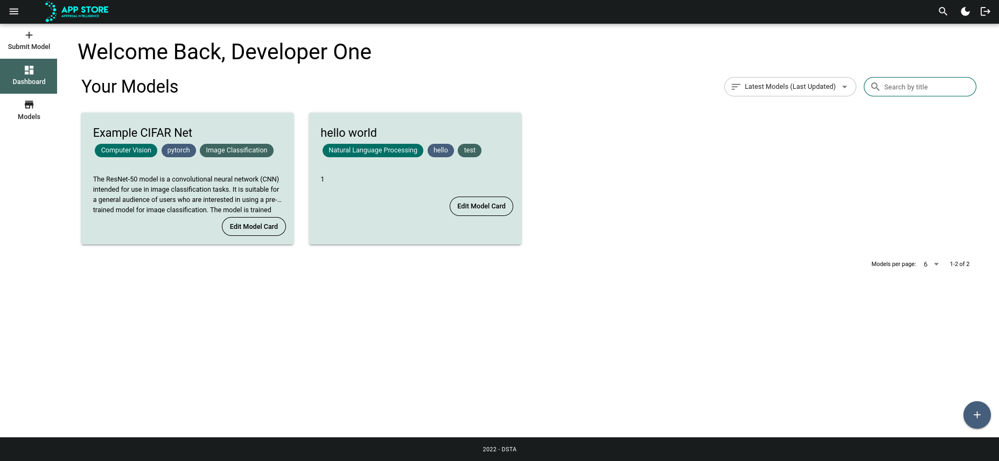
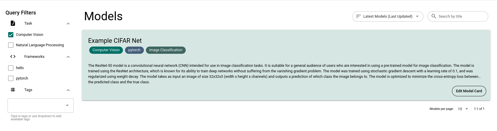
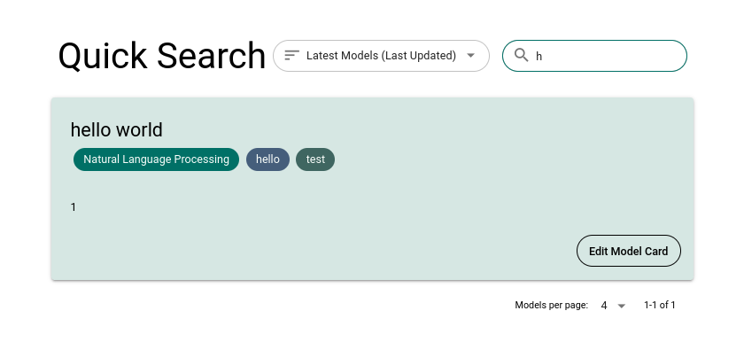
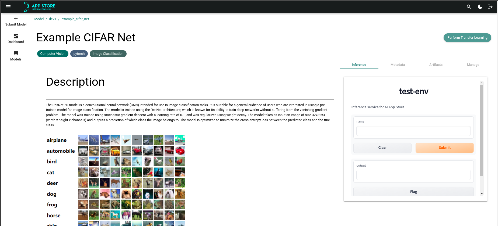
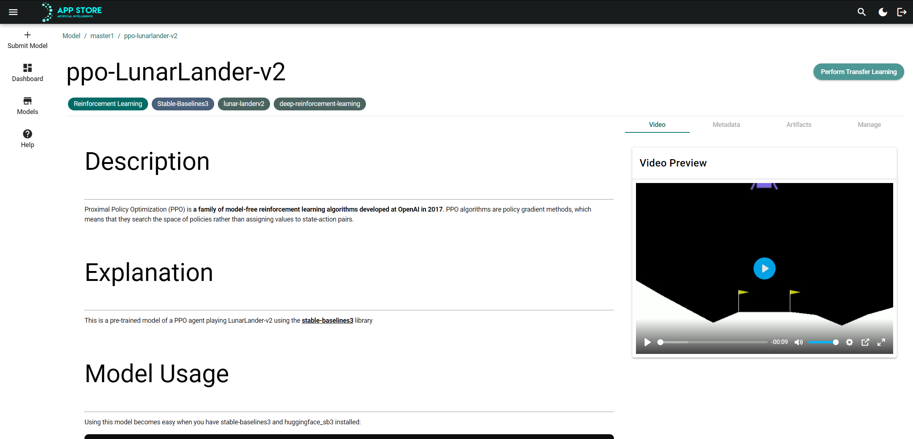

# Searching for Models on the App Store

The App Store offers a range of tools and features to help you find the right models for your needs.

## Dashboard View

The dashboard view is the default view when you first open the App Store. It shows you all of the models you have created. You can use the text search bar and sort options in the dashboard to search through and sort your own models.

Note the following:

- Sidebar on left: Allows you to go to other views in the app store
- Sort options and search bar on top right: Allows you to search and sort your models
- Top bar: Button to go to quick search menu, toggle dark mode, and log out
- FAB on bottom right: Button to create a new model

## Store View

To go to the store view, click on the "Store" button in the sidebar.

The store view shows you all of the models that have been submitted to the store. You can use the text search bar and sort options in the store to search through and sort all of the models in the store.

On the left side of the store view, you can filter models by the following categories:

- **Task**: The task that the model is used for
- **Frameworks**: The frameworks that the model is compatible with
- **Tags**: The tags that have been assigned to the model

## Quick Search

The quick search menu is available on all view by clicking on the search icon in the top right corner of the app. The quick search menu allows you to search for models by name, and sort the results.

# Viewing a Model Card

When you click on a model in the App Store, you will be taken to its model card. The model card provides detailed information about the model, including its performance metrics, input and output variables, and any additional resources or documentation that may be available. You can use the model card to learn more about the model and decide whether it is suitable for your needs.

The model card is divided into two sections: the left side contains markup that details the model description and performance, while the right side contains several tabs with additional information about the model.

On the right side of the model card, you will find the following tabs:

- Inference (Shown if video is not the option): This tab provides a GUI interface that allows you to test out the model by providing input and seeing the output.
- Video (Shown if inference is not the option): This tab has a media player that shows the example video of the agent/model that the developer wants to display.
- Artifacts: This tab lists any references or additional resources that are related to the model, such as the dataset it was trained on or the model weights.
- Metadata: This tab shows you information about the model, such as the dates it was created and modified, who owns the model, and any attributes that have been applied to the model card.
- Manage (only shown if you own the model): This tab allows you to edit and delete the model card.

You can use these tabs to learn more about the model and understand how it can be used.
